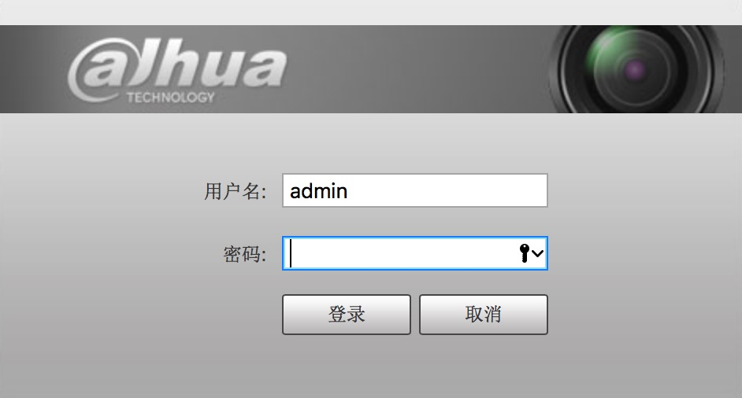
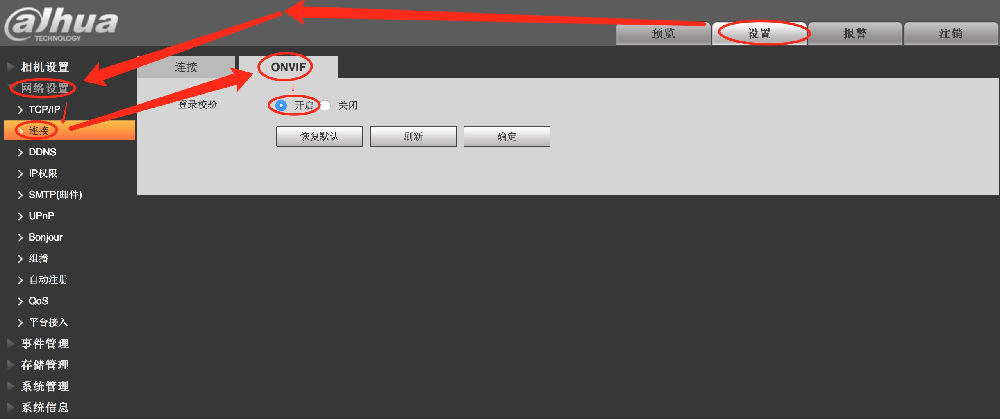
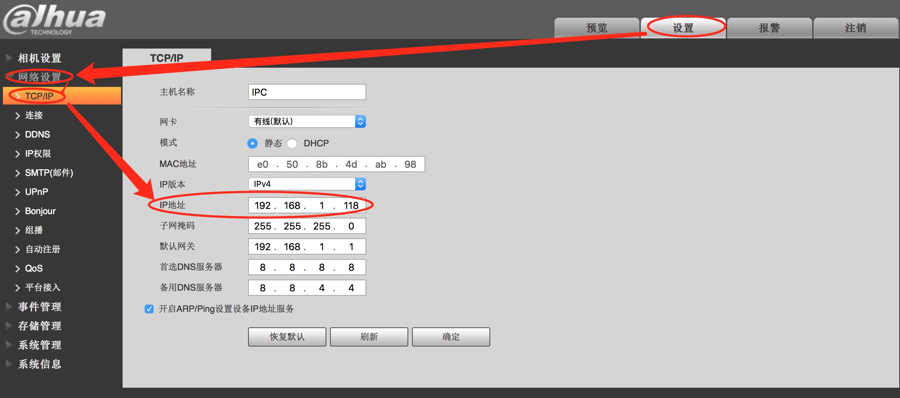
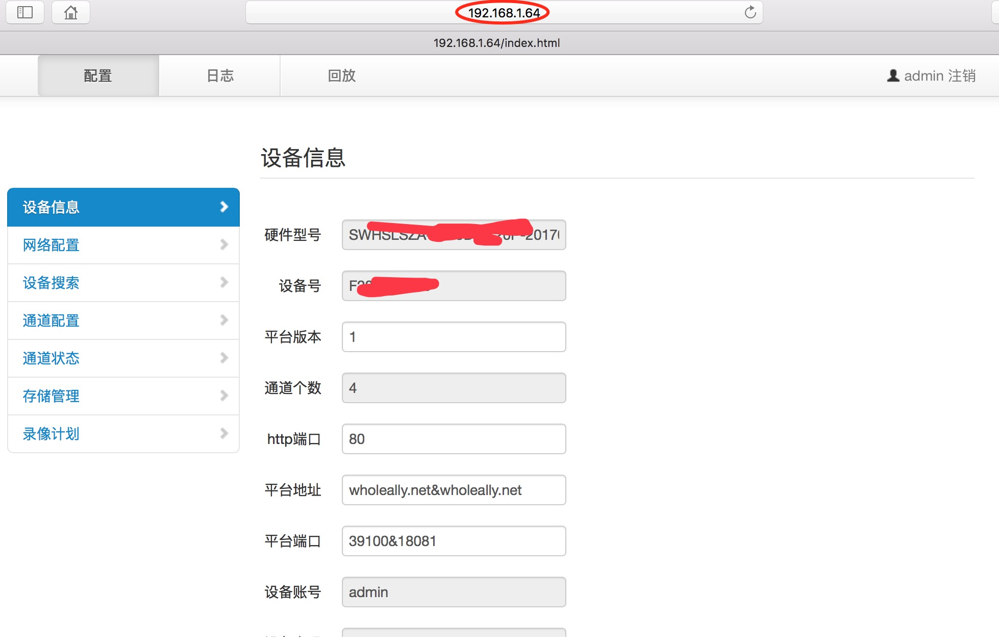
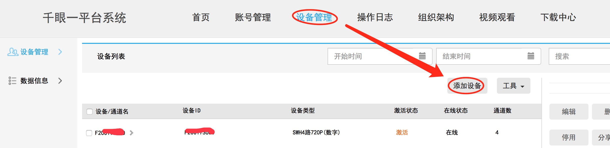

# Camera
Camera demo

##参考
[iOS RTMP 视频直播开发笔记（1）](http://www.360doc.com/content/16/0304/14/19175681_539367835.shtml)

[iOS RTMP 视频直播开发笔记（2）](http://www.360doc.com/content/16/0304/14/19175681_539368429.shtml)

[iOS RTMP 视频直播开发笔记（3）](http://www.360doc.com/content/15/1020/03/19175681_507079027.shtml)

[iOS RTMP 视频直播开发笔记（5）](http://www.360doc.com/content/16/0304/14/19175681_539368687.shtml)

[通过AVAssetWriter将录像视频写到指定文件](http://blog.csdn.net/zengconggen/article/details/7595449)

[做一款仿映客的直播App？看这篇就够了](http://www.cocoachina.com/ios/20160721/17133.html)


##客户端效果 
点击“直播”，进入“直播”页，首先通过CFSoket判断与流媒体服务器地址的连接是否正常，如果正常才可以开始直播。
直播是通过摄像头`UIImagePickerController`来进行采集数据，

iOS 编码实现中需要首先生成 MP4 视频文件，然后从 MP4 文件中提取 NALU 交给下一步做处理，因此这里首先介绍一下 MP4 和 H.264 的相关知识吧。

MP4 是一种视频容器格式，而 H.264 是一种图像编码标准。

#### Screenshots


##原理
实时直播：

* 低清Baseline Level 1.3
* 标清Baseline Level 3
* 半高清Baseline Level 3.1
* 全高清Baseline Level 4.1

存储媒体：

* 低清 Main Level 1.3
* 标清 Main Level 3
* 半高清 Main Level 3.1
* 全高清 Main Level 4.1

既然我们是实时直播，那就应该选择Baseline级别，通过根据视频分辨率和比特率，选择编码标准，例如标清视频使用AVVideoProfileLevelH264Baseline30。

但在iOS7.0以上，可以直接选择AVVideoProfileLevelH264BaselineAutoLevel


原理：`采用硬件加速编码视频`，苹果提供的只有 AVAssetWriter 类，而它只能写入编码后的文件到指定路径的文件中。我们如果想要实时硬编码，例如将视频流输出到网络，这时就需要从输出文件中不断读取新的编码后视频数据。

从代码上看，AVEncoder 通过使用GCD Dispatch Source监听文件的内容改变，通过此方式高效的读取编码后的数据，然而简单的读取 raw data 并不能满足我们的需求，因此在代码中根据Mp4的文件结构（要看懂这里就需要前面介绍的知识了），每次读取一个完整的NALU后再将数据通过 block 传递给外部调用者处理。

AVEncoder -> 读入CMBuffer -> 调用AVAssetWriter编码Buffer -> 设置 header 的 FileHandler -> 获得第一帧（moov[sps, pps]），切换写入文件（寻找mdat），重设FileHandle -> [输入数据 -> 编码 处理循环 ] -> 发送给调用者处理。

##思路
通过`UIImagePickerController`调用摄像头`UIImagePickerControllerSourceTypeCamera`进行数据的捕捉/采集。

对于采集到的数据，我们需要将采集到的原始数据输出成我们所需要的格式，才可以供我们使用。所以这里我们利用AVFoundation建立一个`AVCaptureSession`会话，然后将数据的采集/输入以及输出工作都放在该会话中进行。如：

```
_session = [[AVCaptureSession alloc] init];
......
[_session addInput:videoInput];
[_session addOutput:videoOutput];
```
其中：
①数据的采集，包括采集视频数据`AVMediaTypeVideo`和 音频数据`AVMediaTypeAudio`两种，这两种的采集我们都直接通过`AVCaptureDeviceInput`这个AVCaptureInput的子类来从输入设备`AVCaptureDevice`

```
    NSError *error = nil;
    AVCaptureDevice *dev = [AVCaptureDevice defaultDeviceWithMediaType:AVMediaTypeVideo];
    AVCaptureDeviceInput *videoInput = [AVCaptureDeviceInput deviceInputWithDevice:dev error:&error];
    if (error) {
        NSLog(@"Error: getting video input device: %@", error.description);
    }
    [_session addInput:videoInput];
``` 
②


### 监控
所用设备：拾联的思维盒、大华的摄像头。

拾联的思维盒能够搜索到同一网段中的所有摄像头，前提这些摄像头必须支持onvif，且onvif必须为开启状态。所以，我们需要先设置摄像头。

##### 1、大华摄像头的设置：

1. 对摄像头进行设置前，先插上摄像头的电源和Lan口，只有这样做了我们才能在网页中通过摄像头的ip地址去访问摄像头。
2. 由于大华**摄像头的出厂统一IP地址默认为192.168.1.108**，所以，我们在进行了上述操作后，就可以通过该IP去访问已经连入网络的摄像头了。（附：如果没有连接上，请检查①电源是否插上，②LAN是否插入，以及网线是否可用。自己碰到过插入的网线不可用而导致该摄像头没有真正连入网络的。可通过ping 192.168.1.108检测是否连接上）
3. 当ping成功后，即表示，我们可以通过摄像头的IP正式访问摄像头了。web上输入IP后提示输入摄像头的用户名和密码，**摄像头出厂默认的用户名和密码是都是“admin"**。如果还需要输入端口，出厂的默认端口为37777。

4. 检测是否开始摄像头的onvif功能（因为除了让摄像头和思维盒处在同一网络内外，还必须保证开启了要搜索的那个摄像头的onvif功能，如此才能使得所用的拾联思维盒才能够真正检测到该摄像头）

5. 有时候我们也顺道修改该摄像头的IP。因为我们一般不可能只接入一个摄像头，如果同时接入多个摄像头，而我们又不去改动它们的默认IP，导致一个(默认)IP对应多个摄像头，而引起我们之后在通过思维盒搜索的时候，不知道搜索到的那个IP，现在对应的是哪一台(它是该IP中的随机一台)，所以我们一般会更改该摄像头的IP。

6. 如上步骤结束后，摄像头的工作就算做完了。接下来就是思维盒的问题了。

##### 2、拾联思维盒：
详细参考文档：[数字思维盒详细操作手册](./帮助文档/数字思维盒详细操作手册.pdf)

1. 将思维盒接入电源和LAN网络，同时将思维盒和显示器连接起来。我们需要通过该显示器去设置思维盒的IP访问地址。
2. 通过显示器，进入系统设置->网络设置，这里我们通过自动获取IP，得到思维盒的访问IP地址。假设为192.168.1.64
3. 思维盒的IP设置完成后，我们就不在仅仅可以通过显示器来操作思维盒了，我们还能够通过web来操作思维盒。通过IP访问思维盒的信息如下：

思维盒的具体操作web方式或者显示器方式请查看上面的参考文档。

##### 3、拾联的管理平台：

1. 由上我们已经知道了一个思维盒可以管理多个摄像头了，那是是否也有一个平台来管理我们多个思维盒呢。答案是有的，拾联有一个管理平台来管理多个思维盒。思维盒的管理平台可通过进入[拾联官网](http://www.wholeally.com)后，点击“管理平台”进入。
拾联平台系统1入口

2. 管理平台的一些介绍
要通过管理平台管理思维盒，那肯定我们需要先把我们的思维盒设备添加到我们的管理平台上了。添加方法如下：

附：如果该设备已经被谁添加过了，会有提示。

##### 4、代码开发
参考：[官网demo](http://www.wholeally.com/demo)


